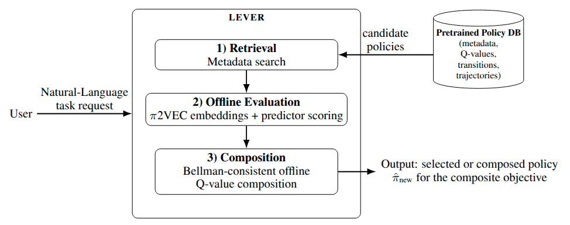

# LEVER
**Inference-Time Policy Composition for Scalable Reinforcement Learning**

[]()



LEVER builds a library of GridWorld policies, embeds them with successor
features (π2vec), predicts performance with a lightweight regressor, and
composes or selects policies at inference time from natural-language queries.

## Setup
```bash
# Conda (recommended)
conda create -n lever python=3.12
conda activate lever
pip install -e .
pip install -r requirements.txt

# or venv
python3.12 -m venv .venv
source .venv/bin/activate
pip install -e .
pip install -r requirements.txt
```

Set `OPENAI_API_KEY` in `.env` if you want LLM-based query decomposition.
Search and composition still work without it.

## Workflow
### 1) Generate policies (state runs)
Grid specifications live in `config.py`. Generate policies for all reward
systems and seeds.

Example for 16x16 (default):
```bash
python policy_reusability/data_generation/tabular/generate_states_batch.py \
  --output-root state_runs
```

Example for 32x32 (same number of interactive items as 16x16 so the structured
state vector has identical shape and the same regressor can be reused):
```bash
python policy_reusability/data_generation/tabular/generate_states_batch.py \
  --output-root state_runs_32 \
  --spec-set grid32
```

Outputs are grouped by spec and timestamp:
```
state_runs/<spec>_<timestamp>/<reward>/seed_0000/
  episode_rewards.csv
  q_table_final.npy
  episodes/episode_000000/{episode_states.npy,q_table.npy,dag.pkl}
```

### 2) Prepare π2vec assets (embeddings, FAISS, regressor)
```bash
python pi2vec_preparation.py \
  --base-dir state_runs \
  --index-path faiss_index/policy.index \
  --metadata-path faiss_index/metadata.pkl \
  --regressor-data-path data/regressor_training_data.json \
  --regressor-model-path models/reward_regressor.pkl \
  --regressor-plot-path plots/regression_plot.jpeg
```

Useful switches:
- `--skip-regressor` to reuse an existing regressor.
- `--no-reset-index` to keep an existing FAISS index.
- `--canonical-states` to change the number of canonical states.

### 3) Run full experiments and plots
```bash
python full_experiment.py \
  --loop-specs \
  --states-folder state_runs \
  --results-dir results \
  --index-path faiss_index/policy.index \
  --metadata-path faiss_index/metadata.pkl

python plots/compare_compositions_average.py \
  --results-dir results \
  --output figs/average_results.png
```

Composition methods:
- Default: Q-value sum (`--composition-method qsum`)
- DAG-based ExNonZeroDiscount (`--composition-method exnonzero`)
Note: empirically, both q-sum and ExNonZeroDiscount can be effective even when
the base policies were trained with $\gamma \neq 0$.

## Search and Compose Policies
```bash
python search_faiss_policies.py "collect gold quickly"
```
Optional filters and controls:
- `--seed 0003` to search within a seed (required to stay in the same MDP layout).
- `--no-decompose` to skip LLM decomposition.

## Reproducibility
The following commands reproduce the core results for 8x8 and 16x16 grids.

1) Generate 8x8 policies:
```bash
python policy_reusability/data_generation/tabular/generate_states_batch.py \
  --output-root state_runs_8 \
  --spec-set grid8
```

2) Generate 16x16 policies:
```bash
python policy_reusability/data_generation/tabular/generate_states_batch.py \
  --output-root state_runs_16 \
  --spec-set grid16
```

3) Build π2vec assets (FAISS + regressor) for 8x8:
```bash
python pi2vec_preparation.py \
  --base-dir state_runs_8 \
  --index-path faiss_index_8/policy.index \
  --metadata-path faiss_index_8/metadata.pkl \
  --regressor-data-path data_8/regressor_training_data.json \
  --regressor-base-path models_8/reward_regressor_base.pkl \
  --regressor-pair-path models_8/reward_regressor_pair.pkl \
  --regressor-trip-path models_8/reward_regressor_trip.pkl \
  --include-combined-rewards \
  --split-regressor-by-spec
```

4) Build π2vec assets (FAISS + regressor) for 16x16:
```bash
python pi2vec_preparation.py \
  --base-dir state_runs_16 \
  --index-path faiss_index_16/policy.index \
  --metadata-path faiss_index_16/metadata.pkl \
  --regressor-data-path data_16/regressor_training_data.json \
  --regressor-base-path models_16/reward_regressor_base.pkl \
  --regressor-pair-path models_16/reward_regressor_pair.pkl \
  --regressor-trip-path models_16/reward_regressor_trip.pkl \
  --include-combined-rewards \
  --split-regressor-by-spec
```
Note: keep the 8x8 and 16x16 predictor outputs (data/models) in distinct folders
to avoid overwriting performance predictor models.

5) Run full_experiment on 8x8:
```bash
python full_experiment.py \
  --loop-specs \
  --states-folder state_runs_8 \
  --results-dir results_8 \
  --index-path faiss_index_8/policy.index \
  --metadata-path faiss_index_8/metadata.pkl \
  --hybrid-top-k 3 \
  --regressor-base-path models_8/reward_regressor_base.pkl \
  --regressor-pair-path models_8/reward_regressor_pair.pkl \
  --regressor-trip-path models_8/reward_regressor_trip.pkl
```

6) Run full_experiment on 16x16:
```bash
python full_experiment.py \
  --loop-specs \
  --states-folder state_runs_16 \
  --results-dir results_16 \
  --index-path faiss_index_16/policy.index \
  --metadata-path faiss_index_16/metadata.pkl \
  --hybrid-top-k 3 \
  --regressor-base-path models_16/reward_regressor_base.pkl \
  --regressor-pair-path models_16/reward_regressor_pair.pkl \
  --regressor-trip-path models_16/reward_regressor_trip.pkl
```

7) Run hybrid top-k sweeps (optional):
```bash
python hybrid_k_sweep.py \
  --state-runs-dir state_runs_8 \
  --index-path faiss_index_8/policy.index \
  --metadata-path faiss_index_8/metadata.pkl \
  --regressor-base-path models_8/reward_regressor_base.pkl \
  --regressor-pair-path models_8/reward_regressor_pair.pkl \
  --regressor-trip-path models_8/reward_regressor_trip.pkl \
  --output results_8/hybrid_k_sweep.csv

python hybrid_k_sweep.py \
  --state-runs-dir state_runs_16 \
  --index-path faiss_index_16/policy.index \
  --metadata-path faiss_index_16/metadata.pkl \
  --regressor-base-path models_16/reward_regressor_base.pkl \
  --regressor-pair-path models_16/reward_regressor_pair.pkl \
  --regressor-trip-path models_16/reward_regressor_trip.pkl \
  --output results_16/hybrid_k_sweep.csv
```

## Project Structure
```
.
├── config.py
├── data/                      # canonical_states_*.npy, regressor_training_data.json
├── faiss_index/               # policy.index and metadata.pkl
├── models/                    # reward_regressor.pkl
├── plots/                     # plotting scripts
├── psi_models/                # successor feature checkpoints
├── state_runs*/               # generated policies and trajectories
├── faiss_utils/               # FAISS setup + viewer
├── pi2vec/                    # successor features, regressor, utilities
├── policy_reusability/        # GridWorld env, agents, DAG utilities
│   └── data_generation/       # data generation workflows
│       ├── deeprl/            # deep RL assets (placeholder)
│       └── tabular/           # tabular grid setup + state/q-table generation scripts
├── search_faiss_policies.py   # CLI search with decomposition/regressor/composition
├── pi2vec_preparation.py      # preparation entrypoint
├── reset_framework.py         # cleanup script
└── full_experiment.py         # experiment runner
```

## Troubleshooting
- Missing index/metadata or regressor: rerun `python pi2vec_preparation.py`.
- Empty search results: check that the seed exists for the reward systems and
  that cosine similarity passes the threshold.
- Query decomposition errors: set `OPENAI_API_KEY` or run with `--no-decompose`.
